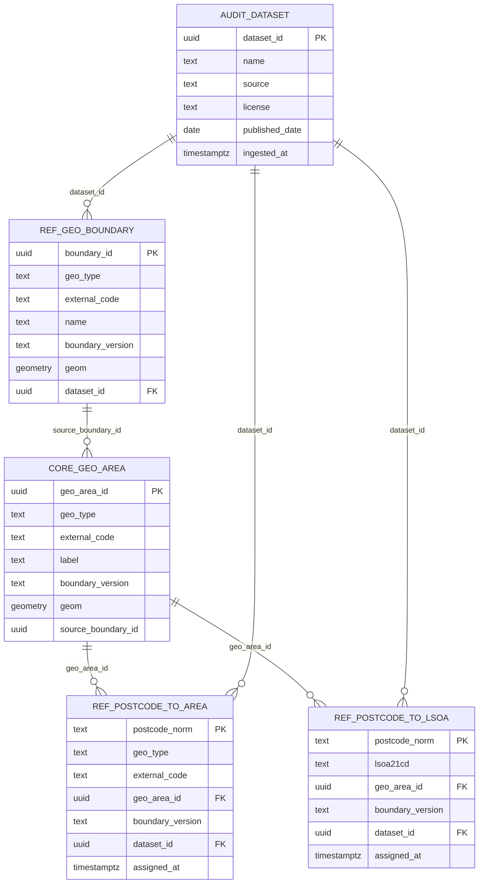

# ProposIQ Database (PostGIS) — Ops & Data Guide

This doc captures **how to run the database**, **what data is inside**, **how to connect**, and **what the DB provides**.

---

## 1) Start the database in Docker

### Prereqs
- Docker Desktop installed (Windows)
- Ports: `5432` available locally

### Recommended: docker-compose (single service, but reproducible)
From the folder containing `docker-compose.yaml`:

```bash
docker compose up -d
docker compose ps
docker compose logs -f db
```

To stop:

```bash
docker compose down
```

To stop **and delete** the persistent volume (⚠️ wipes the database):

```bash
docker compose down -v
```

### Verify health + connect inside container

```bash
docker exec -it proposiq-postgis psql -U proposiq -d proposiq -c "\dx"
docker exec -it proposiq-postgis psql -U proposiq -d proposiq -c "\dn"
docker exec -it proposiq-postgis psql -U proposiq -d proposiq -c "SELECT now();"
```

---

## 2) Tables & ERD (high-level)

### Schemas
You currently use these schemas:
- `audit` — dataset ingestion metadata / audit trail
- `core` — canonical geo entities (areas, points) used by the platform
- `ref` — reference lookups & derived mappings
- `ingest` — staging tables for bulk ingestion
- `ana` / `feat` — reserved for analytics/features (as you expand)

### Core tables (what matters most right now)

#### `audit.dataset`
Tracks “what dataset did this row come from?”
- `dataset_id (uuid)` PK
- `name`, `source`, `license`, `published_date`, `notes`
- `ingested_at` timestamp

#### `ref.geo_boundary`
Raw ingested boundaries (one row per boundary polygon/multipolygon)
- `boundary_id (uuid)` PK
- `geo_type` (e.g. `LSOA`, `DZ`, `SDZ`, `SOA`)
- `external_code` (e.g. `E01000001`, `S01013482`, `N21000001`, etc.)
- `name`
- `boundary_version` (e.g. `2021`, `2022`, `2011`)
- `geom` (PostGIS geometry)
- `dataset_id` FK → `audit.dataset(dataset_id)`
- **Unique** constraint: `(geo_type, external_code, boundary_version)`

#### `core.geo_area`
Canonical version of areas you use throughout the platform
- `geo_area_id (uuid)` PK
- `geo_type`, `external_code`, `label`, `boundary_version`
- `geom`
- `source_boundary_id` (links back to `ref.geo_boundary.boundary_id`)

#### `ref.postcode_to_area`
General purpose mapping: postcode → a geo area (any `geo_type`)
- `postcode_norm` (text) PK **(normalised, no spaces, uppercase)** e.g. `B388DR`
- `geo_type`
- `external_code`
- `geo_area_id` FK → `core.geo_area(geo_area_id)`
- `boundary_version`
- `dataset_id` FK → `audit.dataset`
- `assigned_at` timestamp

#### `ref.postcode_to_lsoa`
Convenience mapping for “small area per postcode”, across UK nations
- `postcode_norm` (text) PK (normalised)
- `lsoa21cd` (text) **this is your “small area code” field name**, even when the code represents:
  - England/Wales LSOA (2021)
  - Scotland Data Zone (2022)
  - Northern Ireland Super Data Zone (2021)
- `geo_area_id` FK → `core.geo_area`
- `boundary_version`
- `dataset_id` FK → `audit.dataset`
- `assigned_at` timestamp

#### `core.postcode_point` (optional / future-ready)
Stores postcode as a point geometry (if you ingest ONSPD or similar)
- `postcode_norm` PK
- `geom` (Point, SRID 27700)
- easting/northing
- `dataset_id`, `ingested_at`

#### `ingest._staging_postcode_bestfit`
Staging table used to bulk-load ONS postcode-to-areas lookup.

---

### ERD (text)
Use this as a mental model:

- `audit.dataset (1) ────< (many) ref.geo_boundary`
- `ref.geo_boundary (1) ────< (many) core.geo_area` (via `source_boundary_id`)
- `core.geo_area (1) ────< (many) ref.postcode_to_area`
- `core.geo_area (1) ────< (many) ref.postcode_to_lsoa`
- `audit.dataset (1) ────< (many) ref.postcode_to_area / ref.postcode_to_lsoa`

### ERD (Mermaid)
If you paste this into a Mermaid viewer:



---

## 3) Summary of datasets currently in the DB (what you ingested)

These are the datasets you’ve already loaded (based on the commands you ran):

### Boundaries
- **England & Wales LSOA (Dec 2021) Boundaries EW BSC (V4)**  
  - ~**35,672** polygons  
  - SRID: **27700**  
  - Stored in: `ref.geo_boundary (geo_type='LSOA', boundary_version='2021')` and `core.geo_area`

- **Northern Ireland Super Data Zones (SDZ 2021) boundaries**  
  - **850** polygons  
  - Source layer: `SDZ2021` (Irish Grid SRID 29902 in file, transformed to 27700 in DB during load)  
  - Stored in: `ref.geo_boundary (geo_type='SDZ', boundary_version='2021')` and `core.geo_area`

- **Scotland Data Zones boundaries (2022)**  
  - **7,392** polygons  
  - SRID: **27700**  
  - Stored in: `ref.geo_boundary (geo_type='DZ', boundary_version='2022')` and `core.geo_area`

> Note: you attempted Scotland DZ 2011, but the postcode lookup you loaded uses **S010…** codes which match **DZ 2022**. That’s why the DZ2011 join was 0.

### Postcode lookup (best-fit)
- **PCD → OA21/LSOA21/MSOA21/LAD (May 2025) UK Lookup**  
  - ~**2,714,964** rows in staging (`ingest._staging_postcode_bestfit`)  
  - Used to populate `ref.postcode_to_area` and the flattened `ref.postcode_to_lsoa`.

### Current mapping coverage (from your counts)
Your `ref.postcode_to_lsoa` currently contains:
- `LSOA 2021`: ~2,401,087 postcodes
- `SDZ 2021`: ~60,191 postcodes
- `DZ 2022`: ~459,198 postcodes

---

## 4) What the database provides (capabilities)

### A) Canonical UK small-area boundary store
You can query boundaries by:
- nation area code (e.g. `E010…`, `S010…`, `N210…`)
- type (`LSOA`, `DZ`, `SDZ`)
- boundary version (`2021`, `2022`, etc.)
- geometry intersection/contains queries (PostGIS)

### B) Postcode → Small Area resolution (the backbone)
With a **normalised postcode** (no spaces, uppercase), you can resolve to:
- Area code (stored in `lsoa21cd` for the “small area code” concept)
- `geo_area_id` for joins to boundary geometry, features, analytics
- boundary version + dataset provenance

### C) Dataset provenance / auditability
Every ingested row can reference a dataset entry, enabling:
- lineage tracking
- “what changed between dataset versions”
- reproducible environments

---

## 5) JDBC driver connection (Quarkus / Java)

### JDBC Driver (PostgreSQL)
Use:
- `org.postgresql:postgresql` (driver)
- PostGIS is server-side; the JDBC driver is still the standard PostgreSQL driver.

### JDBC URL (local Docker)
**Option 1 (host machine):**
```properties
jdbc:postgresql://localhost:5432/proposiq
```

**Option 2 (from another container on same Docker network):**
Use the docker-compose service name (e.g. `db`) as hostname:
```properties
jdbc:postgresql://db:5432/proposiq
```

### Credentials
- Database: `proposiq`
- User: `proposiq`
- Password: `proposiq_dev_pw`

### Example Quarkus config
`application.properties`:

```properties
quarkus.datasource.db-kind=postgresql
quarkus.datasource.username=proposiq
quarkus.datasource.password=proposiq_dev_pw
quarkus.datasource.jdbc.url=jdbc:postgresql://localhost:5432/proposiq
```

---

## 6) Other useful information

### Postcode normalisation (important)
Your DB primary key uses:
- uppercase
- spaces removed

So always query with:
- `B388DR` (NOT `B38 8DR`)

Useful helper in SQL:
```sql
SELECT regexp_replace(upper('B38 8DR'), '\s+', '', 'g');
-- => B388DR
```

### Common health checks
```sql
SELECT COUNT(*) FROM core.geo_area;
SELECT geo_type, boundary_version, COUNT(*) FROM core.geo_area GROUP BY 1,2 ORDER BY 1,2;

SELECT geo_type, boundary_version, COUNT(*) 
FROM ref.postcode_to_area 
GROUP BY 1,2 ORDER BY 1,2;

SELECT ga.geo_type, ga.boundary_version, COUNT(*) AS postcodes
FROM ref.postcode_to_lsoa p
JOIN core.geo_area ga ON ga.geo_area_id = p.geo_area_id
GROUP BY 1,2 ORDER BY 1,2;
```

### PostGIS SRIDs used
- Canonical storage SRID: **27700** (British National Grid)
- NI SDZ shapefile may start as **29902** (Irish Grid) but should be transformed on ingestion.

### Tooling: TablePlus / GUI clients
Yes — you can run queries from TablePlus (or DBeaver / DataGrip):
- Host: `127.0.0.1`
- Port: `5432`
- DB: `proposiq`
- User: `proposiq`
- Password: `proposiq_dev_pw`

---

## Appendix: “What’s in each schema?”
- `audit`: dataset tracking & lineage
- `ingest`: temporary staging tables used by COPY / ogr2ogr loads
- `ref`: reference boundaries and postcode mapping tables
- `core`: canonical “objects” the platform queries against (geo areas, points)

---

If you want, I can extend this doc with:
- exact DDL dumps (`\d+`) for each core table
- recommended indexes for scale (later)
- a repeatable ingestion script (Makefile / bash / PowerShell) for fresh installs


## Userful Docker commands
data backup - 1. docker exec proposiq-postgis pg_dump -U proposiq -d proposiq -F c -f /tmp/propos_backup_01mar2026.dump
			  2. docker cp proposiq-postgis:/tmp/propos_backup_01mar2026.dump C:\ccview\site_selector\data\post-gis-backup\propos_backup_01mar2026.dump


So where does SMILE actually add value?
SMILE earns its place when you go beyond simple descriptive statistics into predictive and machine learning territory. Things PostgreSQL simply cannot do:
TaskPostgreSQLSMILESTD, CV, median, percentiles✅ NativeNot neededDetecting outlier transactionsBasic only✅ Full anomaly detectionPredicting future price trends❌✅ 
Regression modelsPlanning approval probability scoring❌✅ Classification modelsAutomated Valuation Model (AVM)❌✅ Random forest, gradient boostingArea investment scoring (composite)Partial✅ Multi-factor ML modelsClustering similar areas❌
✅ K-means, hierarchical clusteringAnomaly detection on transactions❌✅ Isolation forestConfidence interval on predictions❌✅ Built in to ML models

 Concrete example of where SMILE fits:
A lender asks PropOS:

"What is the predicted value of this property and how confident are you?"

PostgreSQL gives you: median price in the area is £242,700, CV is 0.53.
SMILE gives you: "Predicted value £268,000, confidence interval £241,000 - £295,000, based on 847 comparable transactions weighted by recency, distance, property type and size. Confidence: MEDIUM due to thin local market."
That second answer is what justifies the platform fee. That's an Automated Valuation Model — and PostgreSQL can't build that alone.

Bottom line:
You were right to use SMILE for CV and STD in your existing code — but now that we've moved those calculations into PostgreSQL where they belong, SMILE is freed up for what it's actually best at: building the predictive models that sit in ana.*.


## Useful SQL queries

All PPD years
SELECT 
    EXTRACT(YEAR FROM transfer_date) AS year,
    COUNT(*) AS transactions,
    ROUND(AVG(price)) AS avg_price
FROM ingest.lr_price_paid_raw
GROUP BY EXTRACT(YEAR FROM transfer_date)
ORDER BY year;


